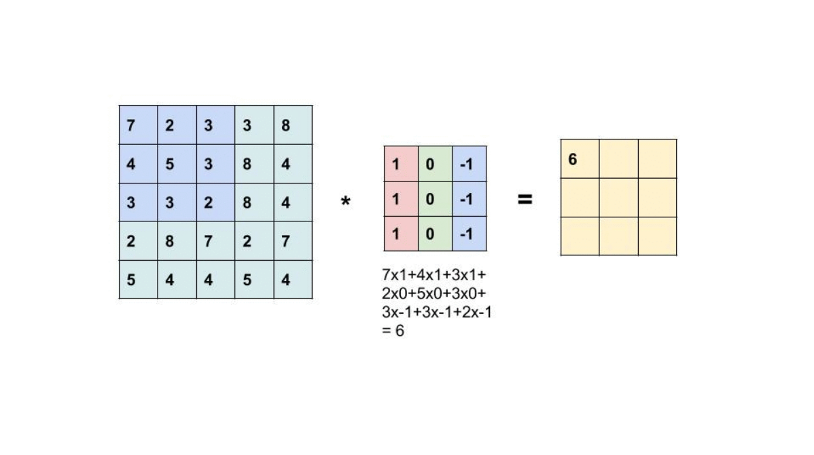

# 11th August, 2024

## CNN: Convolutional Neural Network

### ANN -> CNN... Why?

- Spatial Information: Regional information is used for training and inference.
- Translation Invariant: The ability to ignore positional shifts/differences of the subject of an image.

### Is there any issue in using padding?

- Padding does not change the image. (Why? Cause CNN is translation invariant).
- Computation will increase.

### Filters:-

Contain trainable weights. They get updated during back-prop.

Parameters/Arguments that go in a Conv layer:-

- Number of filters being moved across the img.
- The size of a filter.
- The stride of the filter being moved.

### Pooling layer:-

- Uses multiple possible methods of aggregation- taking the max of all pixels: MaxPooling, average of all pixels: AveragePooling, so on - by sliding a window through a feature map from the previous convolution layer to keep important pixels and drop the rest.
- Promotes faster computation
- Reduces the number of trained parameters
- If done correctly, there should not be much impact on the evaluation metrics of the predictions.
- Usually, the sliding window is a size of (2,2).

### H.W.: Try and define a process to understand backpropagation in a CNN

### Resulting image dimension after a kernel operation:-

$\frac{n}{s} - k + 1$

n = dimension of input image\
k = dimension of filter used

**Incase of inconsistent shapes**: Bring everything to the same padding level, preferably.

#### FYI:-

[Generator Python Object: Read up more.](https://realpython.com/introduction-to-python-generators/)

### Transfer Learning

Assume a successful model, trained on a large dataset: It has the ability to extract features at its lower layers (layers closer to the input).

Transfer Learning is the process of getting these lower layers from the pretrained model and then defining a new classification layer for the same.

#### Assignment: Solve using traditional CNN (image generator, from scratch, etc.). Also use Transfer Learning to classify the same dataset

---

### Vision Transformers

- [Attention is all you need](https://proceedings.neurips.cc/paper_files/paper/2017/file/3f5ee243547dee91fbd053c1c4a845aa-Paper.pdf)
- Contains attention layers
- [An Image is worth 16 x 16 Words](https://openreview.net/pdf?id=YicbFdNTTy)

#### What do transformers solve?

The average CNN is quite good, but...

- there is a lack of global **attention** towards pixels.
- convolution only pays heed to local changes in pixels.

#### Basic intuition

- The naive concept of self attention demands that every pixel be compared with every other pixel. The quadratic cost associated with this process, however, demands a different sequence of steps.
- The input is divided into fixed size flattened 2D patches.
- The embeddings of these patches are fed to the Transformer.
- Position embeddings are added (read: "concatenated", based on the NLP class explanation on the same day) to the patch embeddings.
